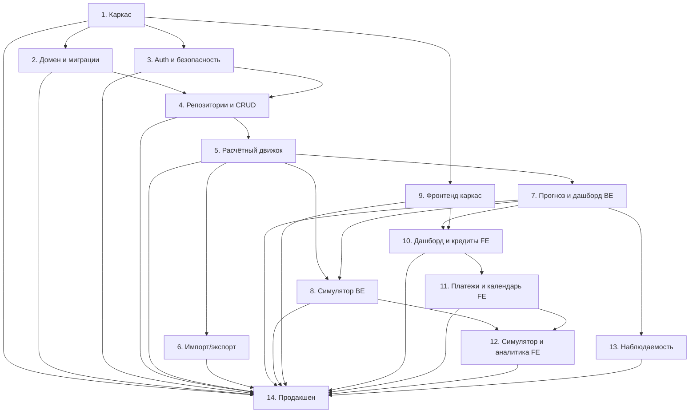

# План реализации — Settle

**Версия:** 1.0
**Дата:** 2026-04-29
**Основание:** `architecture.md` v1.0

---

## Таблица этапов

| # | Название | Сложность | Зависимости | Детали |
|---|---------|-----------|-------------|--------|
| 1 | [Каркас проекта и инфраструктура](#этап-1-каркас-проекта-и-инфраструктура) | M | — | Docker, FastAPI, PostgreSQL, Alembic, Vite, CI-скелет |
| 2 | [Доменная модель и миграции](#этап-2-доменная-модель-и-миграции) | M | 1 | ORM-модели, enums, миграции, audit_log, soft delete |
| 3 | [Аутентификация и безопасность](#этап-3-аутентификация-и-безопасность) | S | 1 | JWT RS256, auth-роутеры, middleware, seed-пользователь |
| 4 | [Репозитории и базовый CRUD](#этап-4-репозитории-и-базовый-crud) | M | 2, 3 | Generic Repository, CRUD для всех сущностей, Pydantic-схемы |
| 5 | [Расчётный движок](#этап-5-расчётный-движок) | L | 4 | ScheduleService, PaymentService, BalanceService, критические тесты |
| 6 | [Импорт и экспорт данных](#этап-6-импорт-и-экспорт-данных) | L | 5 | XLSX-шаблон, dry-run + commit, CLI, идемпотентность, экспорт |
| 7 | [Прогноз и дашборд (бэкенд)](#этап-7-прогноз-и-дашборд-бэкенд) | M | 5 | ForecastService, DashboardService, агрегаты, фоновые задачи |
| 8 | [Симулятор overlay (бэкенд)](#этап-8-симулятор-overlay-бэкенд) | L | 5, 7 | SimulationService, сценарии, применение, сравнение as-is/to-be |
| 9 | [Фронтенд: каркас и дизайн-система](#этап-9-фронтенд-каркас-и-дизайн-система) | M | 1 | Vite + React, роутинг, Tailwind/shadcn, auth-flow, API-клиент |
| 10 | [Фронтенд: дашборд и кредиты](#этап-10-фронтенд-дашборд-и-кредиты) | L | 7, 9 | Виджеты дашборда, список кредитов, карточка, графики |
| 11 | [Фронтенд: платежи, поступления, календарь](#этап-11-фронтенд-платежи-поступления-календарь) | L | 10 | Календарь, регистрация факта, история, поступления |
| 12 | [Фронтенд: симулятор и аналитика](#этап-12-фронтенд-симулятор-и-аналитика) | L | 8, 11 | ScenarioEditor, сравнение, аналитика, оптимизатор |
| 13 | [Наблюдаемость, метрики, health checks](#этап-13-наблюдаемость-метрики-health-checks) | S | 7 | structlog, Prometheus, /health/live, /health/ready |
| 14 | [Продакшен-деплой и финальная верификация](#этап-14-продакшен-деплой-и-финальная-верификация) | M | все | docker-compose.prod, Nginx, HTTPS, бэкап, E2E, адаптивность |

---

## Граф зависимостей

---

## Детали этапов

### Этап 1: Каркас проекта и инфраструктура

**Предусловия:** пустой репозиторий с `architecture.md`.

**Что делается:**
- `docker-compose.dev.yml` с PostgreSQL 16, бэкендом (hot-reload), фронтендом (Vite HMR).
- FastAPI-приложение: `main.py`, `core/config.py` (pydantic-settings), `core/database.py` (async SQLAlchemy engine + session), `core/logging.py` (structlog).
- Alembic init с `env.py` для async.
- Vite + React + TypeScript init.
- `pyproject.toml` с зависимостями: fastapi, uvicorn, sqlalchemy[asyncio], asyncpg, alembic, pydantic-settings, structlog, python-jose[cryptography], argon2-cffi, openpyxl, apscheduler, prometheus-fastapi-instrumentator.
- `package.json` с зависимостями фронта: react, typescript, tailwindcss, shadcn/ui, tanstack-query, zustand, react-router, recharts, date-fns, sonner, zod, react-hook-form, axios.
- CI-скелет (GitHub Actions): линтер + тесты.
- `.env.example` со всеми переменными.
- Makefile или скрипты для типовых команд.

**Артефакты:** работающий `docker compose up` с пустым FastAPI + пустой React.

**Критерий готовности:** `GET /api/health/live` → 200, фронт открывается на `localhost:5173`, контейнеры стартуют без ошибок.

---

### Этап 2: Доменная модель и миграции

**Предусловия:** этап 1 завершён.

**Что делается:**
- PostgreSQL enum-типы (все 12 из раздела 4.2).
- ORM-модели: `users`, `loans`, `loan_balances`, `incomes`, `planned_payments`, `actual_payments`, `scenarios`, `scenario_actions`, `settings`, `audit_log`.
- `is_deleted` + `deleted_at` на таблицах пользовательских данных.
- `audit_log` с JSONB `before_state` / `after_state`.
- Все индексы из раздела 4.4.
- Все уникальные ограничения и CHECK constraints (инварианты из 4.1).
- Python enums зеркалящие PostgreSQL enums (`domain/enums.py`).
- Alembic миграция `001_initial_schema`.
- Nullable `loans.late_fee_rate` (из ADR-003).

**Артефакты:** миграция применяется, таблицы создаются, `downgrade` работает.

**Критерий готовности:** `alembic upgrade head` + `alembic downgrade base` проходят без ошибок; все constraints проверены integration-тестом.

---

### Этап 3: Аутентификация и безопасность

**Предусловия:** этап 1 завершён.

**Что делается:**
- `core/security.py`: генерация/валидация JWT RS256, хеширование argon2id.
- Pydantic-схемы: `LoginRequest`, `TokenResponse`, `RefreshRequest`.
- Роутер `api/routers/auth.py`: `/login`, `/refresh`, `/logout`.
- Dependency `get_current_user` для защиты эндпоинтов.
- Seed пользователя из `.env` при старте (идемпотентно, в lifespan).
- Middleware: request_id, CORS, error-формат RFC 7807.
- Pydantic `ConfigDict(extra='forbid')` на всех request-схемах.

**Артефакты:** работающий auth-flow в API.

**Критерий готовности:** integration-тест: login → получение токена → запрос с токеном → 200; запрос без токена → 401; refresh → новый access_token.

---

### Этап 4: Репозитории и базовый CRUD

**Предусловия:** этапы 2 и 3 завершены.

**Что делается:**
- `repositories/base.py`: generic `Repository[Model]` с `get`, `list`, `create`, `update`, `soft_delete`, `restore`. Автоматическая фильтрация `is_deleted`.
- Специализированные репозитории для каждой сущности.
- Pydantic-схемы (request/response) для всех сущностей с `extra='forbid'`.
- Денежные суммы как строки в JSON (`str` в Pydantic, `Decimal` в домене).
- REST-роутеры: loans, payments (planned + actual), incomes, scenarios, settings.
- Soft delete и audit_log middleware/interceptor (SQLAlchemy event listeners).
- Unit-тесты для audit_log записи.

**Артефакты:** полный CRUD API для всех сущностей.

**Критерий готовности:** integration-тесты на каждый роутер: create → get → list → update → delete → verify is_deleted → verify audit_log записан.

---

### Этап 5: Расчётный движок

**Предусловия:** этап 4 завершён.

**Что делается:**
- `services/schedule_service.py`: `generate_schedule()`, `recalculate_after_prepayment()`, обе стратегии (`reduce_payment`, `shorten_term`).
- `services/balance_service.py`: создание снимков, получение последнего.
- `services/payment_service.py`: регистрация факта (все 6 типов), пересчёт остатка, перегенерация графика, обработка переплаты/недоплаты.
- Все расчёты в `decimal.Decimal`, тест-сканер на `float` в `services/`, `domain/`, `repositories/`.
- Критические тесты из раздела 14.3:
  - Инвариант сходимости графика.
  - Полное досрочное погашение.
  - Частичное досрочное: `reduce_payment`.
  - Частичное досрочное: `shorten_term`.
  - Переплата → избыток на тело.
- Корректировка последнего платежа для обнуления остатка.
- Обработка дат (payment_day, конец месяца).

**Артефакты:** работающий расчётный движок с полным набором критических тестов.

**Критерий готовности:** все критические тесты зелёные, тест на отсутствие `float` проходит. Ручная проверка: создать кредит → зарегистрировать платёж → проверить пересчёт.

---

### Этап 6: Импорт и экспорт данных

**Предусловия:** этап 5 завершён (ScheduleService нужен для авто-генерации графиков).

**Что делается:**
- `services/import_service.py`: парсинг XLSX, Pydantic-DTO, кросс-валидация, dry-run + commit.
- Все 6 листов шаблона: Settings, Loans, Balances, Schedule, Incomes, ActualPayments.
- Идемпотентность по бизнес-ключам (раздел 11.4) — тест обязателен.
- Генерация шаблона (пустой + с примерами).
- Экспорт текущего состояния в XLSX.
- Роутер `api/routers/import_data.py`: upload, commit, template, export.
- CLI: `python -m app.cli template`, `python -m app.cli import`, `python -m app.cli export`.
- Временное хранение dry-run результата (30 мин TTL).

**Артефакты:** работающий импорт/экспорт через API и CLI.

**Критерий готовности:**
- Тест идемпотентности: двойной прогон → идентичная БД.
- Тест полного цикла: export → import → compare.
- Тест валидации: файл с ошибками → корректные сообщения с листом/строкой/колонкой.

---

### Этап 7: Прогноз и дашборд (бэкенд)

**Предусловия:** этап 5 завершён.

**Что делается:**
- `services/forecast_service.py`: `forecast_balance_by_day()` — прогноз «свободные деньги по дням».
- `services/dashboard_service.py`: агрегаты для главной (ближайшие платежи, остаток на жизнь, общий долг, предупреждения).
- Роутер `api/routers/dashboard.py`: единый `GET /api/dashboard`, `GET /api/forecast/balance-by-day`.
- Фоновые задачи (APScheduler в lifespan):
  - `accrue_interest` — ежедневно в 03:00 МСК.
  - `refresh_planned_status` — ежедневно в 00:30 МСК, перевод `pending` → `overdue`.
- Добавление `overdue` в enum `payment_status` (миграция).

**Артефакты:** API дашборда и прогноза, фоновые задачи.

**Критерий готовности:** integration-тест: создать данные → вызвать dashboard → проверить структуру ответа. Тест forecast: доходы/расходы → кривая баланса корректна.

---

### Этап 8: Симулятор overlay (бэкенд)

**Предусловия:** этапы 5 и 7 завершены.

**Что делается:**
- `services/simulation_service.py`: `apply_actions()` — overlay на проекцию в памяти.
- Все 6 типов действий: `close_early_full`, `prepayment_partial`, `reduce_payment`, `skip`, `add_income`, `change_payment_date`.
- Эндпоинт `GET /api/scenarios/{id}/forecast` — as-is + to-be + diff.
- `POST /api/scenarios/{id}/apply` — материализация в одной транзакции.
- `POST /api/scenarios/{id}/archive`.
- Валидация применимости сценария.
- Pydantic-валидация `params` JSONB по типу действия.
- Обязательный тест: «симулятор не пишет в БД» (snapshot до/после).

**Артефакты:** полностью работающий симулятор с overlay и применением.

**Критерий готовности:**
- Тест: создать сценарий → forecast → DB state не изменился.
- Тест: apply → действия материализовались в основных таблицах.
- Тест: каждый тип действия корректно модифицирует проекцию.

---

### Этап 9: Фронтенд: каркас и дизайн-система

**Предусловия:** этап 1 завершён (Vite init).

**Что делается:**
- Tailwind config с кастомными цветами, breakpoints (360, 640, 1024).
- shadcn/ui: установка и кастомизация базовых компонентов (Button, Card, Input, Dialog, Select, Table, Toast, etc.).
- Layout: sidebar (desktop) / bottom nav (mobile), header.
- React Router: защищённые маршруты, redirect на login.
- `api/client.ts`: axios с JWT-интерцептором (access + refresh).
- TanStack Query provider, глобальные настройки (`staleTime`, `cacheTime`).
- Zustand store для UI-state.
- Login-страница.
- Sonner для toast-уведомлений.
- Google Fonts (Inter / Roboto).

**Артефакты:** работающий SPA-каркас с авторизацией.

**Критерий готовности:** пользователь может залогиниться, увидеть layout с навигацией, перейти между пустыми страницами.

---

### Этап 10: Фронтенд: дашборд и кредиты

**Предусловия:** этапы 7 и 9 завершены.

**Что делается:**
- **Дашборд:**
  - Виджет «следующие 3 платежа» с цветовой индикацией.
  - Виджет «остаток на жизнь» со светофором.
  - Виджет «общий долг» с дельтой.
  - График прогноза остатка по дням (Recharts).
  - Лента предупреждений.
- **Кредиты:**
  - Список карточек с фильтрами (тип, статус, ставка, приоритет).
  - Детальная карточка: информация, остаток, график тело/проценты (stacked bar).
  - Формы: создание, редактирование, обновление остатка.
  - Кнопки: «Зарегистрировать платёж», «Обновить остаток», «Закрыть досрочно».
  - Иконка точности на каждом платеже.
  - Переключатель стратегии досрочного погашения.
- Адаптивная вёрстка: мобайл (1 колонка) → планшет (2) → десктоп (3).

**Артефакты:** работающие дашборд и раздел кредитов.

**Критерий готовности:** визуальная проверка на 360px, 768px, 1280px. Данные из API корректно отображаются, формы работают.

---

### Этап 11: Фронтенд: платежи, поступления, календарь

**Предусловия:** этап 10 завершён.

**Что делается:**
- **Календарь платежей:**
  - Вид месяц/неделя.
  - Цветовая кодировка по типу (кредит — синий, сплит — фиолетовый, коммуналка — серый, прочее — красный).
  - Клик по дню → список платежей.
  - Иконка «можно заранее».
- **Регистрация фактического платежа:**
  - Форма с автоопределением типа из соотношения сумм.
  - Показ результата пересчёта (новый остаток, новый график) перед подтверждением.
  - Отмена платежа.
- **Поступления:**
  - CRUD, пометка получения.
  - Связь с плановыми платежами.
- **История:**
  - Лента фактических платежей с фильтрами.
  - Карточки изменений (из audit_log).
- Мобильная адаптация: таблицы → карточки.

**Артефакты:** полный UI платёжного контура.

**Критерий готовности:** end-to-end flow: создать кредит → увидеть в календаре → зарегистрировать платёж → проверить пересчёт на карточке кредита.

---

### Этап 12: Фронтенд: симулятор и аналитика

**Предусловия:** этапы 8 и 11 завершены.

**Что делается:**
- **Симулятор:**
  - Двухпанельный интерфейс (side-by-side на десктопе, табы на мобайле).
  - Слева: список сценариев, редактор действий.
  - Справа: два графика прогноза, числовая разница (экономия процентов, даты закрытия, суммарные выплаты).
  - Форма добавления действия (wizard для сложных).
  - Кнопки «Применить» и «Архивировать».
- **Аналитика:**
  - Структура выплат по периодам: тело vs проценты vs рассрочки (stacked bar).
  - Разбивка по банкам и типам (pie chart).
  - Оптимизатор приоритетов: рекомендация по методу лавины.
- **Настройки:**
  - Формы для параметров (курс, лимиты, коммуналка).
  - Кнопка «Скачать шаблон» и «Импорт Excel».
  - Экспорт в JSON/XLSX.

**Артефакты:** полный UI симулятора, аналитики и настроек.

**Критерий готовности:** создать сценарий → добавить действие → увидеть сравнение → применить → проверить материализацию на дашборде.

---

### Этап 13: Наблюдаемость, метрики, health checks

**Предусловия:** этап 7 завершён.

**Что делается:**
- structlog: JSON-формат, `request_id` в middleware, уровни по архитектуре (раздел 13.1).
- Фильтрация чувствительных данных в логах (раздел 12.4).
- `prometheus-fastapi-instrumentator` на `/metrics`.
- Кастомные метрики: `loan_balance_total`, `payments_planned_today`, `forecast_compute_duration_seconds`.
- `GET /api/health/live`, `GET /api/health/ready` (проверка БД + миграции).
- Docker healthcheck на бэкенде.

**Артефакты:** логи, метрики, health checks.

**Критерий готовности:** healthcheck в docker-compose работает, `/metrics` отдаёт данные, логи в JSON-формате с `request_id`.

---

### Этап 14: Продакшен-деплой и финальная верификация

**Предусловия:** все предыдущие этапы завершены.

**Что делается:**
- `docker-compose.prod.yml` с Nginx, HTTPS (certbot), secrets.
- `Dockerfile` для бэкенда и фронта (multi-stage builds).
- Entrypoint бэкенда: `alembic upgrade head` при старте.
- Nginx config: проксирование `/api/*`, отдача статики, security headers.
- Cron бэкапов: `pg_dump` + ротация 30 дней.
- `.env.example` со всеми prod-переменными.
- GitHub Actions CI: lint → unit → integration → build.
- E2E тесты (Playwright): login → dashboard → create loan → register payment → simulator.
- Верификация адаптивности: 360px, 768px, 1280px.
- Проверка критериев готовности из раздела 16.2.

**Артефакты:** production-ready сборка, пройденные E2E.

**Критерий готовности:** все пункты раздела 16.2 архитектуры выполнены.

---

## Открытые вопросы (раздел 17 архитектуры)

Все четыре вопроса разобраны в [docs/decisions.md](file:///home/andrey/PycharmProjects/settle/docs/decisions.md):

| # | Вопрос | ADR | Рекомендация |
|---|--------|-----|-------------|
| A | Хостинг | ADR-001 | VPS с Let's Encrypt |
| B | Дефолт досрочного погашения | ADR-002 | `reduce_payment` |
| C | Граница underpayment/missed | ADR-003 | amount=0 → missed, >0 → underpayment; `late_fee_rate` nullable |
| D | Точность калькуляторов | ADR-004 | Порог 1%, UI-предупреждение, без корректирующего коэффициента |

---

## Риски и митигации

| Риск | Вероятность | Влияние | Митигация |
|------|------------|---------|-----------|
| Ошибки в расчётном движке (округление, граничные случаи) | Высокая | Критическое | Критические тесты из 14.3 пишутся одновременно с кодом. Все расчёты в `Decimal`, тест-сканер на `float`. |
| Расхождение расчётного графика с банковским | Средняя | Среднее | Иконки точности в UI, предупреждение при расхождении >1% (ADR-004). |
| Сложность XLSX-импорта (edge cases, форматы) | Средняя | Среднее | Строгая Pydantic-валидация каждой строки, dry-run обязателен, кросс-валидация ссылочной целостности. |
| Overlay-симулятор случайно пишет в БД | Низкая | Критическое | Обязательный тест: snapshot DB до/после forecast. Архитектурно overlay работает только в памяти. |
| Потеря данных при деплое | Низкая | Критическое | `pg_dump` ежедневно, 30 дней ротация, еженедельная копия в Google Drive. Бэкап/восстановление отрабатывается на тестовом стенде. |
| Сложность UI для мобильной вёрстки (календарь, симулятор) | Средняя | Среднее | Календарь → лента по дням, симулятор → табы вместо side-by-side. Проверка на 360px. |
| JWT-ключи утекают в логи | Низкая | Высокое | Фильтрация чувствительных данных в structlog (раздел 12.4), `.env` не в репозитории. |

---

## План верификации

### Автоматические тесты

- **Unit:** сервисы (schedule, payment, balance, simulation, forecast) — моки репозиториев, `pytest`.
- **Integration:** роутеры с PostgreSQL в testcontainer, полные CRUD-циклы.
- **Float-сканер:** `grep -rn 'float(' backend/app/services/ backend/app/domain/ backend/app/repositories/` → должен быть пустым.
- **Идемпотентность импорта:** двойной прогон XLSX → asserting identical DB state.
- **Overlay invariant:** DB snapshot before/after simulation forecast → assertEqual.
- **CI:** `ruff` + `mypy --strict` (бэк), `eslint` + `tsc` (фронт), unit, integration.

### E2E (Playwright)

- Login flow.
- Dashboard отображает данные.
- CRUD кредита.
- Регистрация платежа → пересчёт.
- Симулятор: создание → сравнение → применение.
- Импорт Excel → проверка данных.

### Ручная верификация

- Адаптивность: 360px, 768px, 1280px.
- Backup/restore на тестовом стенде.
- HTTPS с валидным сертификатом.
