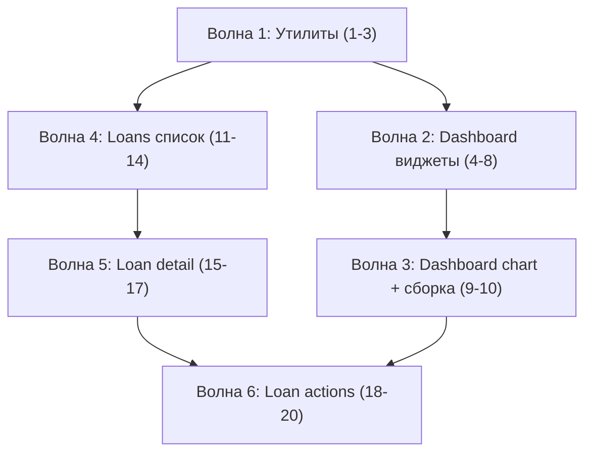

# Этап 10: Фронтенд — дашборд и кредиты

## Декомпозиция на atomic-задачи

Этап L-сложности, 2 больших фичи. Разбит на 6 волн, ~18 задач.

---

### Волна 1: Утилиты и общие компоненты

| # | Задача | Файлы | Описание |
|---|--------|-------|----------|
| 1 | Утилиты форматирования | `src/lib/format.ts` | `formatMoney()`, `formatDate()`, `formatPercent()`, `formatDelta()` — единый источник для всех экранов. date-fns с русской локалью. |
| 2 | shadcn: дополнительные компоненты | `src/components/ui/` | badge, dialog, select, table, tabs, tooltip, progress — добавить через shadcn CLI. |
| 3 | Компонент LoadingState | `src/components/loading-state.tsx` | Skeleton-обёртка для useQuery: loading / error / empty / children. Reusable. |

---

### Волна 2: Дашборд — виджеты

| # | Задача | Файлы | Описание |
|---|--------|-------|----------|
| 4 | Hook useDashboard | `src/features/dashboard/hooks.ts` | useQuery на `getDashboard()`, TanStack Query key `['dashboard']`. |
| 5 | NextPaymentsWidget | `src/features/dashboard/next-payments.tsx` | Карточка «Следующие 3 платежа» с цветовой индикацией (overdue=danger, pending ≤3d=warning, rest=default). |
| 6 | CurrentPeriodWidget | `src/features/dashboard/current-period.tsx` | «Остаток на жизнь» — большая цифра, светофор (comfortable/tight/deficit), income → payments_total → remaining. |
| 7 | TotalsWidget | `src/features/dashboard/totals-widget.tsx` | «Общий долг» — total_debt, active_loans, month_to_month_change (delta с цветом). |
| 8 | WarningsWidget | `src/features/dashboard/warnings-widget.tsx` | Лента предупреждений — иконка + message для каждого warning. |

---

### Волна 3: Дашборд — график и сборка

| # | Задача | Файлы | Описание |
|---|--------|-------|----------|
| 9 | ForecastChart | `src/features/dashboard/forecast-chart.tsx` | Recharts AreaChart: баланс по дням, tooltip с датой и суммой, gradient fill. useQuery на `getForecast()`. |
| 10 | DashboardPage сборка | `src/pages/dashboard.tsx` | Замена заглушки: grid layout (1→2→3 колонки), все виджеты + chart. |

---

### Волна 4: Кредиты — список

| # | Задача | Файлы | Описание |
|---|--------|-------|----------|
| 11 | Hook useLoans | `src/features/loans/hooks.ts` | useQuery `['loans']`, useMutation для create/update/delete с invalidation. |
| 12 | LoanCard | `src/features/loans/loan-card.tsx` | Карточка кредита: creditor, name, type badge, rate, current_balance (из latest balance), status badge, priority indicator. |
| 13 | LoanFilters | `src/features/loans/loan-filters.tsx` | Фильтры: по типу (multi-select), статусу, поиск по имени/creditor. |
| 14 | LoansPage сборка | `src/pages/loans.tsx` | Замена заглушки: список LoanCard с фильтрами, кнопка «Добавить кредит». |

---

### Волна 5: Кредиты — детальная карточка

| # | Задача | Файлы | Описание |
|---|--------|-------|----------|
| 15 | LoanDetailPage | `src/pages/loan-detail.tsx` + route | Полная карточка: информация, текущий баланс, stacked bar (тело/проценты), список planned_payments. Новый route `/loans/:id`. |
| 16 | ScheduleChart | `src/features/loans/schedule-chart.tsx` | Recharts BarChart (stacked): principal vs interest по месяцам. |
| 17 | LoanForm (create/edit) | `src/features/loans/loan-form.tsx` | Dialog с react-hook-form + zod. Создание и редактирование. |

---

### Волна 6: Кредиты — действия и финализация

| # | Задача | Файлы | Описание |
|---|--------|-------|----------|
| 18 | BalanceUpdateForm | `src/features/loans/balance-form.tsx` | Dialog для ручного обновления остатка (amount, snapshot_date, note). POST /loans/{id}/balance. |
| 19 | PrepaymentStrategyToggle | `src/features/loans/strategy-toggle.tsx` | Переключатель reduce_payment / shorten_term на карточке кредита. PATCH /loans/{id}. |
| 20 | Проверка tsc + ESLint + build | — | Финальная верификация: tsc --noEmit, eslint, production build. |

---

## Порядок реализации

## Критерий готовности этапа

- Дашборд отображает реальные данные из API (все 4 виджета + chart).
- Список кредитов с фильтрами, переход на detail page.
- Detail page: информация, баланс, график тело/проценты, список платежей.
- Формы: создание кредита, редактирование, обновление баланса.
- Адаптивная вёрстка: 360px, 768px, 1280px.
- `tsc --noEmit` clean, ESLint clean, production build passes.
