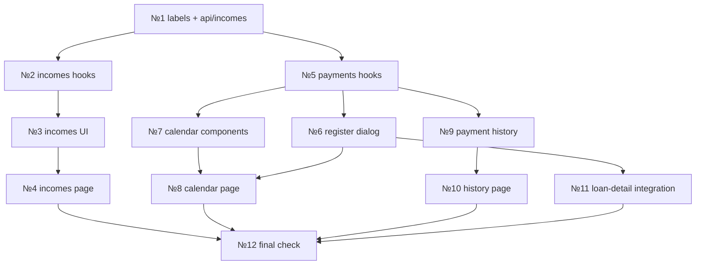

# Этап 11: Фронтенд — платежи, поступления, календарь

## Декомпозиция на atomic-подзадачи

Этап содержит 4 feature-области (календарь, регистрация платежей,
поступления, история) + сквозные задачи (labels, hooks, routing).
Разбит на 7 волн по зависимостям.

---

### Волна 0: Инфраструктура (labels, API hooks, routing)

#### №1. Расширение format.ts + API-модуль incomes

**Файлы:**
- `src/lib/format.ts` — добавить labels для `income_status`, `actual_payment_type`
- `src/api/incomes.ts` — новый API-модуль (уже заявлен в api/, но нужно проверить наличие — в listing есть только `dashboard.ts`, `loans.ts`, `payments.ts`, `scenarios.ts`, `settings.ts`, `import-export.ts` — incomes отсутствует!)

**Что делается:**
- Labels: `INCOME_STATUS_LABELS`, `ACTUAL_PAYMENT_TYPE_LABELS` + export функции `incomeStatusLabel()`, `actualPaymentTypeLabel()`
- `api/incomes.ts`: `getIncomes()`, `createIncome()`, `updateIncome()`, `receiveIncome()`, `deleteIncome()`
- Проверка: tsc clean

**Ожидаемый размер:** ~60 строк (incomes.ts) + ~20 строк дополнений в format.ts

---

### Волна 1: Поступления (CRUD + receive)

#### №2. features/incomes/hooks.ts — TanStack Query hooks

**Файлы:** `src/features/incomes/hooks.ts`

**Что делается:**
- `useIncomes(params?)`, `useCreateIncome()`, `useUpdateIncome(id)`, `useReceiveIncome()`, `useDeleteIncome()`
- Инвалидация: `incomes`, `dashboard`, `forecast`
- Toast уведомления на русском

**Ожидаемый размер:** ~90 строк

#### №3. features/incomes/ — компоненты UI

**Файлы:**
- `src/features/incomes/income-card.tsx` — карточка поступления
- `src/features/incomes/income-form.tsx` — диалог create/edit (react-hook-form + zod)
- `src/features/incomes/income-filters.tsx` — фильтры (status, search)

**Что делается:**
- IncomeCard: код, имя, сумма, дата, статус badge, кнопка «Получено»
- IncomeFormDialog: create/edit mode, поля code/name/amount/expected_date/status/notes
- IncomeFilters: поиск + select status

**Ожидаемый размер:** ~100 + ~150 + ~60 = ~310 строк

#### №4. pages/incomes.tsx — страница поступлений + route

**Файлы:**
- `src/pages/incomes.tsx` — страница списка
- `src/routes/index.tsx` — добавить маршрут `/incomes`

**Что делается:**
- Страница по паттерну loans.tsx: заголовок, фильтры, grid карточек, кнопка «+ Добавить»
- Добавить route в router
- Обновить навигацию в sidebar/mobile nav (добавить пункт «Поступления»)

**Ожидаемый размер:** ~80 строк (page) + ~5 строк (route)

---

### Волна 2: Регистрация фактического платежа

#### №5. features/payments/hooks.ts — TanStack Query hooks

**Файлы:** `src/features/payments/hooks.ts`

**Что делается:**
- `usePlannedPayments(params?)`, `useActualPayments(params?)`, `useRegisterPayment()`, `useDeleteActualPayment()`, `useUpdatePlannedPayment()`
- Инвалидация: `payments`, `loans`, `dashboard`, `forecast`

**Ожидаемый размер:** ~100 строк

#### №6. features/payments/register-payment-dialog.tsx — форма регистрации

**Файлы:** `src/features/payments/register-payment-dialog.tsx`

**Что делается:**
- Dialog с react-hook-form + zod
- Выбор кредита (select из loans), выбор planned_payment (select из planned по loan_id)
- Поля: amount, payment_date, payment_type (auto-suggest из соотношения сумм), notes
- Auto-determine type: сравнение введённой суммы с planned.amount
- Предупреждение при underpayment/overpayment
- Submit → registerPayment mutation

**Ожидаемый размер:** ~250 строк

---

### Волна 3: Календарь платежей

#### №7. features/calendar/ — компоненты календаря

**Файлы:**
- `src/features/calendar/hooks.ts` — query hooks для planned payments в диапазоне
- `src/features/calendar/calendar-grid.tsx` — сетка месяца
- `src/features/calendar/day-cell.tsx` — ячейка дня с цветовыми маркерами
- `src/features/calendar/day-detail.tsx` — popup/sheet с платежами дня
- `src/features/calendar/calendar-header.tsx` — навигация по месяцам

**Что делается:**
- Сетка 7×6 (пн–вс × 6 недель)
- Цветовая кодировка по loan_type: credit=синий, split=фиолетовый, utilities=серый, other_debt=красный, installment=зеленый
- Клик по дню → список платежей с суммами и статусами
- Навигация: < Месяц Год >
- На mobile: лента по дням (вертикальный список) вместо сетки
- Иконка «можно заранее» (can_pay_early)
- Нужна связка planned_payments с loan через дополнительный запрос loans для получения loan_type (planned payment содержит loan_id)

**Ожидаемый размер:** ~80 (hooks) + ~180 (grid) + ~60 (cell) + ~100 (detail) + ~50 (header) = ~470 строк

#### №8. pages/calendar.tsx — замена заглушки

**Файлы:** `src/pages/calendar.tsx`

**Что делается:**
- Заменить placeholder на CalendarGrid + CalendarHeader
- Кнопка «Зарегистрировать платёж» → открытие RegisterPaymentDialog
- Responsive: grid на desktop, лента на mobile

**Ожидаемый размер:** ~60 строк

---

### Волна 4: История платежей

#### №9. features/payments/payment-history.tsx — лента истории

**Файлы:**
- `src/features/payments/payment-history.tsx` — список фактических платежей
- `src/features/payments/payment-card.tsx` — карточка одного платежа
- `src/features/payments/payment-filters.tsx` — фильтры (loan, date range, type)

**Что делается:**
- Лента фактических платежей (actual) с фильтрацией по loan_id, date range
- PaymentCard: loan name, amount, date, type badge, notes
- Фильтры: select по кредиту, date range (from/to), type select
- На mobile: карточки; на desktop: таблица

**Ожидаемый размер:** ~120 (history) + ~80 (card) + ~80 (filters) = ~280 строк

#### №10. pages/history.tsx + route — страница истории

**Файлы:**
- `src/pages/history.tsx` — страница
- `src/routes/index.tsx` — добавить route `/history`
- Навигация: добавить пункт «История» в sidebar/mobile nav

**Ожидаемый размер:** ~50 строк

---

### Волна 5: Интеграция с loan-detail + кнопки действий

#### №11. Интеграция RegisterPaymentDialog в loan-detail

**Файлы:** `src/pages/loan-detail.tsx`

**Что делается:**
- Кнопка «Зарегистрировать платёж» → RegisterPaymentDialog с pre-filled loan_id
- Показ ближайшего pending planned_payment
- Обновить секцию planned payments: добавить status badges, accuracy иконки

**Ожидаемый размер:** ~30 строк дополнений

---

### Волна 6: Финальная проверка и polish

#### №12. Сквозная проверка

- tsc --noEmit clean
- ESLint clean
- Production build passes
- Навигация sidebar/mobile nav — все пункты на месте
- Responsive: 360px, 768px, 1280px — визуальная проверка

---

## Граф зависимостей

## Оценка объёма

| Задача | Файлов | Строк |
|--------|--------|-------|
| №1 labels + api | 2 | ~80 |
| №2 incomes hooks | 1 | ~90 |
| №3 incomes UI | 3 | ~310 |
| №4 incomes page | 2+ | ~85 |
| №5 payments hooks | 1 | ~100 |
| №6 register dialog | 1 | ~250 |
| №7 calendar | 5 | ~470 |
| №8 calendar page | 1 | ~60 |
| №9 payment history | 3 | ~280 |
| №10 history page | 2+ | ~50 |
| №11 integration | 1 | ~30 |
| №12 check | — | — |
| **Итого** | **~22** | **~1805** |
